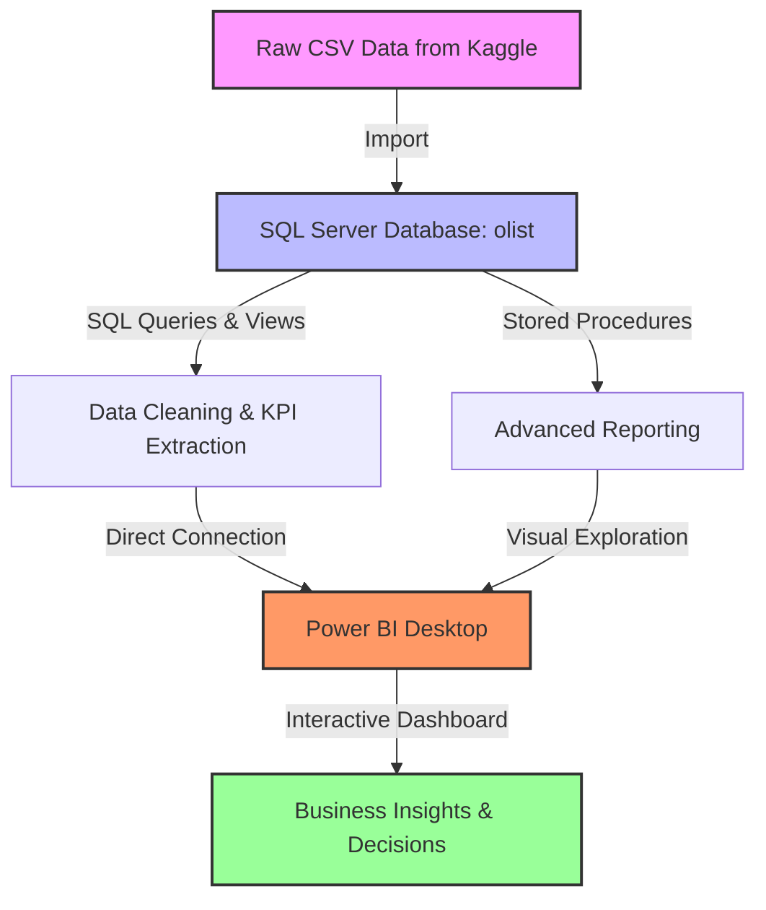
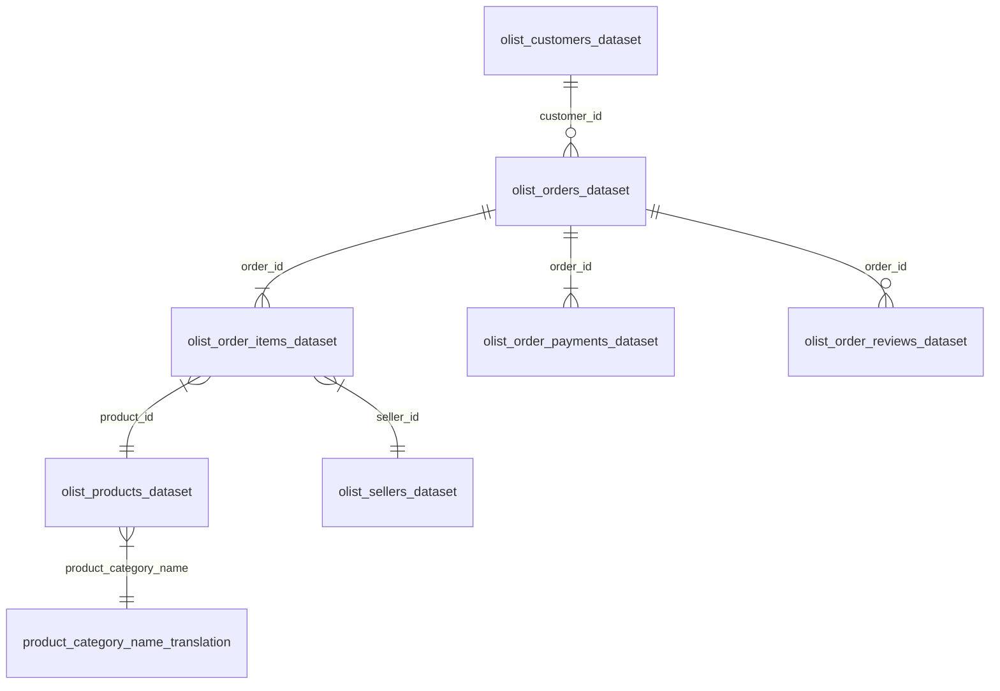

# 🇧🇷 Brazilian E-Commerce Analysis | SQL & Power BI
## 📊 مشروع تحليل بيانات التجارة الإلكترونية في البرازيل باستخدام SQL و Power BI

<p align="center">
  
</p>

<p align="center">
  
  
  
  
</p>

---

## 📝 Project Overview | نظرة عامة على المشروع

### English
This project provides a comprehensive end-to-end data analysis solution for **Olist**, the largest department store e-commerce platform in Brazilian marketplaces. By integrating **SQL Server** for data cleaning, transformation, and querying, with **Power BI** for interactive dashboards, this project extracts actionable business insights regarding customer behavior, seller performance, products, logistics, and financial trends.

### بالعربية
يقدم هذا المشروع حلاً متكاملاً لتحليل البيانات لشركة **Olist**، وهي أكبر منصة تجارة إلكترونية للمتاجر في البرازيل. من خلال دمج **SQL Server** لتنظيف البيانات، تحويلها، وإجراء الاستعلامات المتقدمة، مع **Power BI** لبناء لوحات تحكم تفاعلية وديناميكية. يهدف المشروع إلى استخلاص رؤى تجارية قيمة وقابلة للتطبيق حول سلوك العملاء، أداء البائعين، المنتجات، الخدمات اللوجستية، والاتجاهات المالية.

---

## 🛠️ Tech Stack & Architecture | التقنيات وبنية المشروع



* **Database Engine**: Microsoft SQL Server (T-SQL)
* **Visualization tool**: Power BI Desktop
* **Dataset source**: Olist Public E-Commerce Dataset (Kaggle)

---

## 📁 Repository Structure | هيكل المستودع

```text
├── sql/
│   └── olist_queries.sql       # Cleaned & formatted SQL queries, views, and procedures
├── dashboard/
│   └── olist_dashboard.pbix    # Power BI Dashboard file
├── docs/
│   ├── images/
│   │   └── olist_logo.png      # Olist logo used in documentation
│   └── SQL Project.docx        # Project requirements and documentation
├── .gitignore                  # Prevents committing heavy raw CSV/ZIP files
└── README.md                   # Project documentation
```

---

## 🗄️ Database Schema & ERD | هيكل قاعدة البيانات والعلاقات

The dataset consists of 9 relational tables representing Olist operations between 2016 and 2018:



---

## 🔍 SQL Insights & Analytical Queries | تحليلات الـ SQL والاستعلامات

The SQL script `sql/olist_queries.sql` answers critical business questions. Below are some highlights:

### 1. Delivery Performance & Logistics Delay (الأداء اللوجستي وتأخر الشحن)
Calculates the average delay in days between estimated and actual delivery dates, and categorizes orders:
```sql
-- Average delivery delay (actual vs estimated)
SELECT AVG(DATEDIFF(DAY, order_estimated_delivery_date, order_delivered_customer_date)) AS avg_delivery_delay_days
FROM olist_orders_dataset
WHERE order_delivered_customer_date IS NOT NULL;

-- Categorizing deliveries
SELECT 
    CASE 
        WHEN DATEDIFF(DAY, order_estimated_delivery_date, order_delivered_customer_date) > 0 THEN 'Delayed'
        WHEN DATEDIFF(DAY, order_estimated_delivery_date, order_delivered_customer_date) = 0 THEN 'On Time'
        ELSE 'Early'
    END AS delivery_status,
    COUNT(*) AS total_orders
FROM olist_orders_dataset
WHERE order_delivered_customer_date IS NOT NULL
GROUP BY ...
```

### 2. Seller Ranking by Revenue within States using Window Functions (ترتيب البائعين حسب الإيرادات)
```sql
SELECT 
    oi.seller_id,
    s.seller_state,
    SUM(oi.price + oi.freight_value) AS total_revenue,
    RANK() OVER (PARTITION BY s.seller_state ORDER BY SUM(oi.price + oi.freight_value) DESC) AS revenue_rank
FROM olist_order_items_dataset oi 
JOIN olist_sellers_dataset s ON oi.seller_id = s.seller_id
GROUP BY s.seller_state, oi.seller_id;
```

### 3. Seller Target Classification for 2018 (تصنيف البائعين حسب الأهداف البيعية)
Flags sellers based on items sold and revenue in 2018:
* **Below Target**: Sold < 50 items OR revenue < $5,000.
* **Within Target**: Sold 50-100 items OR revenue between $5,000 and $10,000.
* **Above Target**: Exceeds both targets.

---

## 📊 Power BI Dashboard Details | لوحة تحكم Power BI التفاعلية

The dashboard `dashboard/olist_dashboard.pbix` contains five main interactive pages:

1. **Sales Overview (نظرة عامة على المبيعات)**: Tracks Sales KPIs (Total Orders, Revenue, Average Order Value) with monthly trend analysis.
2. **Customer Insights (تحليلات العملاء)**: Examines purchase concentration by state, identifying top spenders and customer distribution.
3. **Seller Performance (أداء البائعين)**: Analyzes seller revenues, ranks them within states, and correlates their sales with review scores.
4. **Product Analysis (تحليل المنتجات)**: Visualizes sales by product category and identifies best/worst-selling items.
5. **Logistics & Delivery (الخدمات اللوجستية)**: Monitors shipping delays, compares actual vs. estimated delivery times, and flags late deliveries.

---

## 🚀 How to Run the Project | كيفية تشغيل المشروع

### Step 1: Download the Dataset
Download the raw CSV dataset from Kaggle:
👉 [Kaggle Olist Dataset Link](https://www.kaggle.com/datasets/olistbr/brazilian-ecommerce)

### Step 2: Import into SQL Server
1. Create a database named `olist`.
2. Import the CSV files into tables with matching names (e.g., `olist_customers_dataset.csv` into `olist_customers_dataset`).
3. Open and run the `sql/olist_queries.sql` file to clean database entries, build operational views, and execute stored procedures.

### Step 3: Run the Dashboard
1. Ensure you have **Power BI Desktop** installed.
2. Open `dashboard/olist_dashboard.pbix`.
3. Go to **Home > Transform Data > Data source settings** and update the server name to your local SQL Server instance.
4. Click **Refresh** to load the data.

---
## 👤 Author
**Mohamed Gamal Eldeen Ismail**  
🔗 [LinkedIn](https://www.linkedin.com/in/mohamed-gamal-eldeen/) | 💻 [GitHub](https://github.com/mo7amedgamal2)
